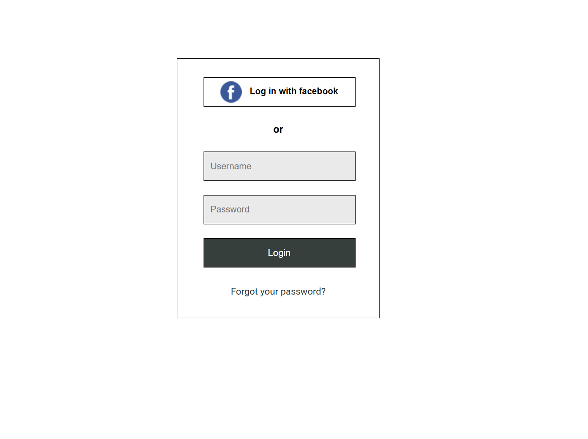
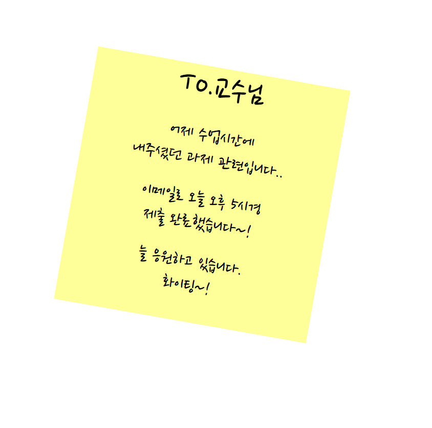

# 🎨 Frontend Mini Projects

HTML/CSS 및 프론트엔드 기초 실습 프로젝트 모음입니다.  
단순 정적 페이지에서 시작해, 점차 Spring 기반의 동적 웹 구현까지 확장해갑니다.

- 목표: HTML/CSS 기본기 → 프론트엔드 구조 이해 → Spring MVC 웹 연동까지 단계별 학습
- 개발 환경: VS Code, Spring Boot, GitHub, Chrome

---

## 📚 목차 (Quick Nav)
- [실습 1. 로그인 페이지](login/)
- [실습 2. 포스터잇 메모](postit/)
- [실습 3. 플렉스 박스 레이아웃](flexbox/)
- [실습 4. 그리드 레이아웃(반응형)](grid/)
- [실습 5. To-Do List (Spring + View)](todolist/)

## 🧩 실습 1. 로그인 페이지 (`/login`)

**📄 index.html**
- `form`, `fieldset`, `label`, `input`, `button` 태그를 활용한 로그인 폼 구성  
- Facebook 로고 버튼 및 일반 로그인 입력창 구현  
- “Forgot your password?” 링크 포함

**🎨 style.css**
- Google Fonts(`Roboto`) 적용  
- 입력창과 버튼의 크기, 간격, 여백 스타일링  
- 로고와 텍스트 정렬(`vertical-align`, `margin-right`) 처리  
- `fieldset`, `legend`를 시각적으로 숨기고 구조적 의미는 유지  

  

**💡 핵심 포인트**
> 시맨틱 마크업과 기본적인 폼 구성 능력을 익히는 실습입니다.

---

## 📝 실습 2. 포스터잇 메모 앱 (`/postit`)

**📄 index.html**
- 노트 메모지 형태의 단일 콘텐츠 구성  
- 3개의 단락(`p`)으로 메시지 표현  

**🎨 style.css**
- Google Fonts(`Nanum Pen Script`) 적용  
- `transform: rotate(10deg)`을 활용한 기울기 효과  
- 손글씨 느낌과 여백 조절로 실제 포스트잇처럼 표현  

  

**💡 핵심 포인트**
> 감성적인 UI 스타일링, `transform`과 폰트 조합을 통한 시각 디자인 감각 향상.

---

## 🧱 실습 3. 플렉스 박스 레이아웃 (`/flexbox`) _(예정)_

**목표**
- `display: flex`를 이용한 정렬, 방향, 간격 제어  
- 중앙 정렬, 수평·수직 배치, wrap 등 다양한 속성 실습  
- 반응형 레이아웃의 기초 익히기  

**예상 학습 포인트**
- `justify-content`, `align-items`, `flex-direction`, `gap`  

---

## 🧮 실습 4. 그리드 레이아웃 (반응형) (`/grid`) _(예정)_

**목표**
- `display: grid`를 이용한 2D 레이아웃 설계  
- `grid-template-columns`, `fr`, `minmax()` 등 활용  
- 화면 크기에 따른 반응형 배치 구성  

---

## ✅ 실습 5. To-Do List (Spring + View) (`/todolist`) _(예정)_

**목표**
- Spring Boot + JSP(또는 Thymeleaf) 기반의 To-Do List 웹앱 구현  
- 기본 CRUD(Create, Read, Update, Delete) 기능 학습  
- Controller, Service, View, Model 구조 익히기  

**예상 구조**
todolist/
├── src/main/java/.../controller/
├── src/main/resources/templates/ (또는 /webapp/WEB-INF/views/)
├── src/main/resources/static/css/
├── pom.xml
└── application.yml

**💡 핵심 포인트**
> 프론트엔드 정적 구성에서 MVC 패턴 기반의 동적 웹 구조로 확장하는 단계.

GitHub: https://github.com/yourname/frontend-mini-projects